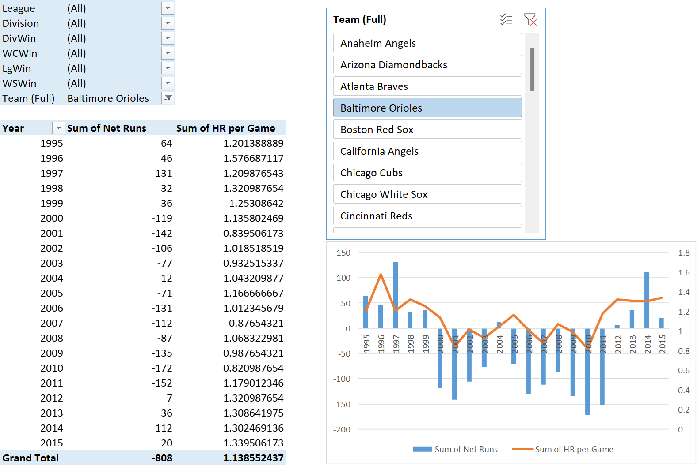

&nbsp;

&nbsp;

## IMDb 

Interactive dashboard to analyze the data on IMDB movies, including actors, rating, social media engagement and revenue.

## Case studies

Interactive dashboards to explore case studies about stocks quotes, shark attacks, product ratings and more.

Shown here: baseball team stats analysis.

Example: Daily weather conditions.

